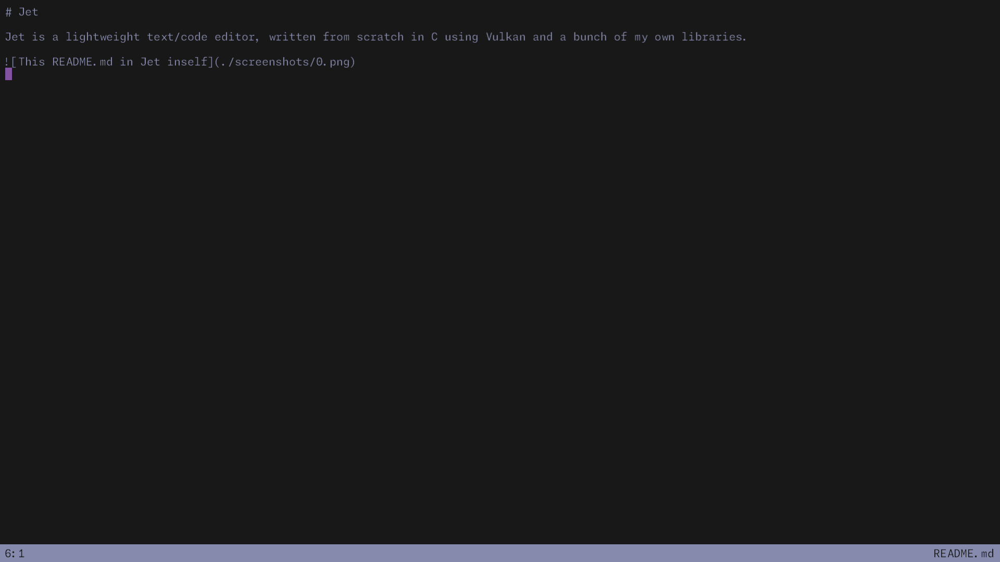

# Jet

**!!! PROJECT IS WORK IN PROGRESS !!!**

Jet is a lightweight text/code editor, written from scratch in C using Vulkan and a bunch of my own libraries.



## Quick start

Jet uses [my custom build system](https://github.com/oxxide216/nsb).

```shell
cc -o nsb nsb.c
./nsb
```
